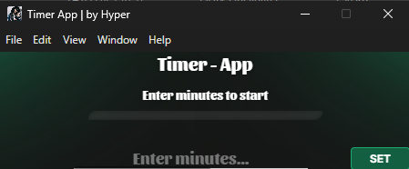

# Timer App

A simple and elegant timer application that continues running in the system tray.



## Features

- **Minimalist Design**: Clean, modern user interface
- **Easy to Use**: Enter minutes and press SET to start
- **Tray Integration**: App continues running in the background when window is closed
- **Visual Indicators**: Progress bar with color transitions (green → yellow → red)
- **Notifications**: Windows notifications when timer completes
- **Keyboard Support**: Start/stop timer using the Enter key

## Installation

1. Clone the repository or download as ZIP
2. Install dependencies:
   ```
   npm install
   ```
3. Start the app:
   ```
   npm start
   ```

## Usage

1. Enter the desired time in minutes (maximum 180 minutes / 3 hours)
2. Click "SET" or press Enter to start the timer
3. The timer continues running even when the window is closed
4. Access through the tray icon for:
   - Opening the Timer app
   - Viewing remaining time
   - Stopping the timer
   - Exiting the app

## Development

The app uses Electron for cross-platform compatibility.

### Project Structure

- `src/index.js` - Main process, tray functionality and timer logic
- `src/preload.js` - Secure communication between main and renderer processes
- `src/renderer.js` - UI logic and event handlers
- `src/index.html` - HTML structure of the app
- `src/index.css` - UI styling
- `src/image/` - Icons and background images

### Build

To package the app for distribution:

```
npm run make
```

## Technologies

- **Electron** - Framework for cross-platform desktop apps
- **Vanilla JavaScript** - For app logic
- **CSS** - For styling and animations
- **HTML** - For UI structure

## Author

Developed by Hyper

## License

MIT 